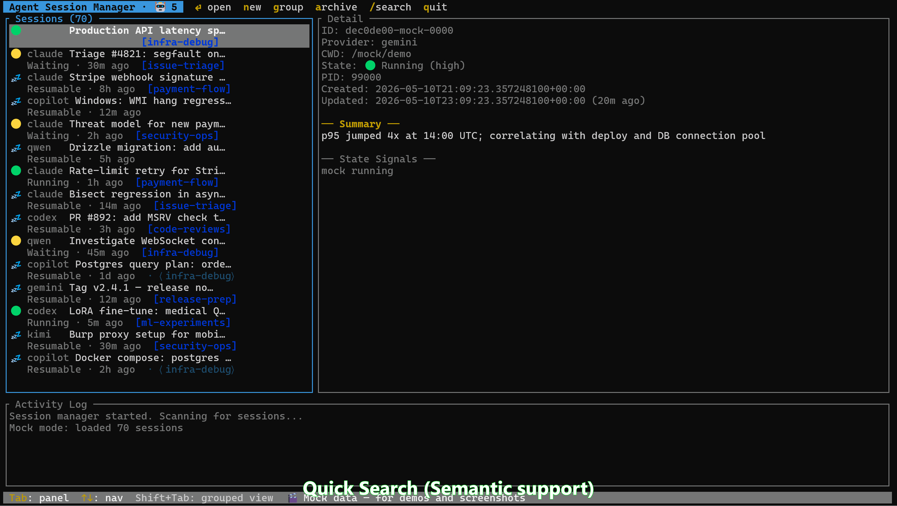

# Agent CLI Session TUI

**Agent view for every CLI** — one screen for parallel Copilot, Claude, Codex, Qwen, Gemini, Kimi background sessions.



## Pain Points Solved

- **Where is my running agent?** — `Enter` on any 🟡 *Needs input* / 🟢 *Working* session to attach / focus its terminal tab
- **Too many tabs** — every background session in one view with clear status badges
- **Which needs my input?** — 🟡 *Needs input* vs 🟢 *Working* vs 💤 *Resumable* at a glance
- **Finding that one session** — `/` to search. Hybrid ranking fuses keyword (BM25) + semantic embeddings + lexical scoring via Reciprocal Rank Fusion, so typos, paraphrases, and half-remembered phrases all land the right session. Indexes titles, summaries, compaction summaries, and your own messages
- **Hundreds of sessions piling up** — `g` to assign to groups; `Shift+Tab` to view by group; optional [AI auto-suggest](#ai-auto-grouping)
- **Close without worry** — shut down anytime; all sessions remain discoverable + resumable
- **Resume after reboot** — summaries, last activity, full last response so you can pick up the right one

## Beyond `claude agents`

Claude Code's [`claude agents`](https://code.claude.com/docs/en/agent-view) is single-vendor and only shows sessions **it** dispatched. This TUI does more:

| What we add | |
|---|---|
| **Multi-CLI** | One screen for Copilot · Claude · Codex · Qwen · Gemini · Kimi |
| **Sees every session, not just backgrounded ones** | Plain `claude` and `claude agents` are two disjoint pools today — sessions you ran with `claude` (interactive) never appear in `claude agents`, past or future, unless you explicitly background them. This TUI reads each CLI's own session directory, so every session shows up regardless of how it was started |
| **Hybrid content search** | BM25 keyword + semantic embeddings + lexical scoring fused via Reciprocal Rank Fusion. Tolerates typos and paraphrases without penalizing exact matches. Searches titles, summaries, and your own messages mid-transcript |
| **Thematic groups** | `g` to tag any session into a named group; `Shift+Tab` to browse by group |
| **AI-suggested groups** | Optional ACP-driven auto-clustering of ungrouped sessions |
- **Resume after reboot** — summaries, last activity, full last response so you can pick up the right one

## Beyond Intelligent Terminal

[**Intelligent Terminal**](https://github.com/microsoft/intelligent-terminal) is an experimental fork of Windows Terminal with native agent integration — the *terminal* that hosts your agent CLI. This TUI is the *cross-CLI switchboard* for everything those agents leave behind.

| What we add | |
|---|---|
| **Cross-CLI, not single-host** | Intelligent Terminal hosts one agent per pane. This TUI surfaces every session from every provider — Copilot, Claude, Codex, Qwen, Gemini, Kimi — in one list |
| **Hybrid content search** | BM25 + semantic embeddings + lexical, fused via RRF. Find a session by typo, paraphrase, or half-remembered phrase across every provider at once |
| **Thematic groups across providers** | Group sessions by project or theme regardless of which CLI ran them; optional AI-suggested clustering |
| **Runs anywhere** | Pure ratatui TUI — works inside Intelligent Terminal, Windows Terminal, tmux, or any plain terminal on Windows / Linux / macOS |

Use them together: Intelligent Terminal for the conversation, this TUI for the catalog.

## Architecture

```
┌─────────────────────────────────────────────────────────────┐
│ TUI (ratatui + crossterm)                                   │
│  Session List  │  Session Detail  │  Activity Log           │
│  Hybrid RRF Search (BM25 + semantic + lexical) · Tab Focus │
├─────────────────────────────────────────────────────────────┤
│ SessionViewModel (incremental merge, phased loading)        │
│ Supervisor (tokio — parallel provider scans, non-blocking)  │
│  Discovery · Process matching · Launch/Resume (config-driven)│
├─────────────────────────────────────────────────────────────┤
│ Provider plugins (data-only — read from each CLI's state)   │
│  Copilot │ Claude │ Codex │ Qwen │ Gemini │ Kimi │ (more…) │
├─────────────────────────────────────────────────────────────┤
│ Shared infrastructure                                       │
│  Process detection │ Semantic DLL (optional) │ Archive store │
└─────────────────────────────────────────────────────────────┘
```

No internal database. Providers read directly from each CLI's own state directory (read-only). All providers scan in parallel for fast refresh. The `SessionViewModel` merges results incrementally per-provider for progressive loading.

### Session States

Three states, mirroring `claude agents` vocabulary:

| Badge | This TUI    | `claude agents` | Meaning |
|-------|-------------|-----------------|---------|
| 🟢    | **Running** | *Working*       | Actively running tools or generating a response |
| 🟡    | **Waiting** | *Needs input*   | Finished — waiting for your reply / permission |
| 💤    | **Resumable** | *Completed*   | Not currently running — attach / resume anytime |

`Enter` on *Running* / *Waiting* attaches (focuses existing terminal tab). `Enter` on *Resumable* relaunches.

## Keybindings

| Key | Action |
|-----|--------|
| `↑`/`↓` or `j`/`k` | Navigate sessions |
| `Enter` (⏎) | Resume selected session — focuses the WT tab if Running, launches otherwise |
| `n` | New session (launches default provider) |
| `a` | Archive session (instantly hidden) |
| `g` | Assign current session to a group (← → pick from existing, type to add new) |
| `s` | Run AI grouping on the top ungrouped sessions (Grouped view) — see [AI Auto-Grouping](#ai-auto-grouping) |
| `y` / `n` / `e` | Accept / dismiss / edit pending AI suggestion (cursor must be on a session with a 🤖 shadow) |
| `/` | Search (type to filter, `↑`/`↓` to browse, `Enter` to resume, `Esc` to cancel) |
| `Shift+Tab` | Cycle Active → Grouped → Hidden views |
| `Tab` | Switch panel focus (works for all 5 providers) |
| `PgUp`/`PgDn` | Scroll detail panel |
| `Esc` | Cancel search |
| `q` / `Ctrl+C` | Quit |

Native mouse text selection works (click-drag to highlight and copy).

## Supported Providers

| Provider | State Dir | Session Format |
|----------|-----------|----------------|
| **Copilot CLI** | `~/.copilot/session-state/` | `workspace.yaml` + `events.jsonl` + lock files |
| **Claude Code** | `~/.claude/projects/` | `<encoded-cwd>/<session-id>.jsonl` |
| **Codex CLI** | `~/.codex/sessions/` | Session directories with state files |
| **Qwen CLI** | `~/.qwen/projects/` | `<encoded-cwd>/chats/<session-id>.jsonl` |
| **Gemini CLI** | `~/.gemini/tmp/` | `<project>/chats/session-*.jsonl` + subdirs |
| **Kimi** | `~/.kimi/sessions/` | Session JSONL files |

## Configuration

Copy `config.toml.example` next to the binary and rename to `config.toml`:

```toml
data_dir = '~/.local/share/agent-session-tui'
poll_interval_ms = 2000
log_max_lines = 500

[providers.copilot]
enabled = true
default = true          # 'n' launches this provider
command = "copilot"
default_args = []
state_dir = '~/.copilot/session-state'
resume_flag = "--resume"
launch_method = "wt"    # "wt" | "pwsh" | "cmd"
launch_fallback = "cmd" # optional — fallback if primary not found

[providers.claude]
enabled = true
command = "claude"
default_args = []
state_dir = '~/.claude/projects'
resume_flag = "--resume"
launch_method = "wt"
```

For full control over launch commands, use custom launcher fields:

```toml
# Windows — open in a new Windows Terminal tab
launch_cmd = "wt"
launch_args = ["-w", "0", "new-tab", "--startingDirectory", "{cwd}", "cmd", "/k", "{command}"]

# Linux/macOS — open in a new tmux window
# launch_cmd = "tmux"
# launch_args = ["new-window", "-c", "{cwd}", "{command}"]
```

Placeholders: `{cwd}` → working directory, `{command}` → the agent CLI command.

Config search order: next to exe → `%APPDATA%/agent-session-tui/config.toml` → built-in defaults.

## Search

Search is a hybrid ranker. Three independent signals score every session, then **Reciprocal Rank Fusion** (RRF) combines their ranked lists into a single ordering:

| Signal | What it catches |
|--------|-----------------|
| **BM25** (Tantivy full-text index) | Exact keywords, multi-word phrases, weighted titles |
| **Semantic** (cached embeddings, optional DLL) | Paraphrases — "improve grammar" finds "Polish English Writing" |
| **Lexical** (substring + fuzzy) | Typos and partial recall — "iteation revew" still finds "Iteration Review" |

On top of fusion: an **exact-title substring lock** pins any session whose title literally contains your query to rank 1, so remembering the query correctly is never penalized. State and recency act as soft tie-breakers.

### Measured on real session data

30-query benchmark over ~780 sessions, comparing the previous additive scorer with the current RRF default:

|                  | Additive | **RRF (default)** |
|------------------|----------|-------------------|
| MRR              | 0.696    | **0.802**         |
| P@1              | 53%      | **73%**           |
| Recall@10        | 93%      | 90%               |

Per-category P@1 jumps: exact-title 33% → 100%, person-name 50% → 100%, semantic-only 38% → 62%, typo 0% → 33%. Keyword and partial-recall queries hold their ground.

### What you get out of the box

- No flags, no opt-in — RRF is the default scorer
- The semantic signal needs the optional `semantic_search.dll` / `.so` / `.dylib` plugin; without it, the ranker degrades gracefully to BM25 + lexical
- Embeddings are pre-computed and cached per session — search itself never embeds
- Status bar shows 🧠 when the semantic plugin is loaded
- Indexes are incremental — only changed sessions are re-indexed on each scan
- **No index migration needed** when upgrading: schema, fingerprints, and embedding cache are unchanged

### Built-in evaluation harness

```bash
agent-session-tui --search-bench "iteration review" --expect <session_id> --top 10
agent-session-tui --search-eval --report eval/runs/today.json
```

Reads a gitignored `eval/search-queries.toml` of (query, expected session) pairs and reports MRR / P@1 / Recall@K, per-category and overall. Useful for catching ranking regressions before they ship.

The semantic plugin lives in `semantic-plugin/`. See [`CONTRIBUTING.md` § Semantic Search Plugin](CONTRIBUTING.md#semantic-search-plugin) for the build + install steps.

## AI Auto-Grouping

Suggests thematic groups for your ungrouped sessions. Runs automatically; press
`s` in the Grouped view to run on demand. Suggestions appear as a dim
`· ⟨group⟩` shadow under the session row — `y` accepts, `n` dismisses, `e` edits
the name first.

Sessions that look like an **already-grouped** session are suggested for that
same existing group instead of a brand-new one.

### Engines

Set with `[grouping] engine` in `config.toml`.

**`remote` — the default.** Sends session titles and working directories to a
hosted tab auto-grouping service, which returns natural group names like
"System Maintenance". About 2 seconds for 30 sessions. Nothing to install or
authenticate.

**`local`** — no network. This is *not* a local AI model: it simply compares how
many words two titles share, and names each group after its most common words.
That produces blunt names like `benchmark-prompt-files`, so expect to rename
some with `e`. It runs in ~0.2s and is also the automatic fallback whenever
`remote` fails.

**`acp`** — legacy. Spawns the CLI configured in `[acp]` (default `copilot`).
Best names, but 25–45s per batch and it burns your Copilot quota. Requires the
`copilot` CLI authenticated and `prompts/group-suggest.md` next to the binary.
A run exceeding `timeout_secs` is **terminated**, not just abandoned.

```toml
[grouping]
engine = "remote"     # "remote" | "local" | "acp"
language = "en-US"    # language for generated group names
timeout_secs = 20     # remote call timeout
```

### What `remote` sends

- **Sent:** session titles and working directories (as `file:///` URIs), for one
  representative per cluster of near-duplicate sessions. In testing that reduced
  40 sessions to 8 entries. The working directory is included because it
  measurably improves results.
- **Never sent:** session summaries, file contents, chat transcripts.
- **On any failure** — non-2xx, timeout, schema change — it silently falls back
  to `local`. Grouping never breaks.

> **Note:** the grouping service is Microsoft-hosted and its endpoint is
> undocumented — there's no published contract or data-handling terms, and it
> could change without notice. Titles and folder paths can contain repository
> and project names, and they do leave your machine. If that isn't acceptable
> for your work, set `engine = "local"`.

### Other group-view keys

- `g` — assign the selected session to an existing group (← → to pick) or type a new one

Groups are sorted by most-recent member activity, frozen on entry to the Grouped view to avoid jitter on the 2-second scan refresh. To refresh the order, leave and re-enter the view via `Shift+Tab`.

## Release Packages

| Package | Size | Contents |
|---------|------|----------|
| **Core** | ~1.1 MB | `agent-session-tui` binary only |
| **Semantic** | ~26 MB | Core + `semantic_search_plugin` DLL |

Built for **x64** and **arm64** across all three platforms (Windows, Linux, macOS).

## Adding a Provider

See [`.github/instructions/plugin.instructions.md`](.github/instructions/plugin.instructions.md) for the full guide.

Implement the `Provider` trait (data-only — no launch/resume logic needed):

```rust
pub trait Provider: Send + Sync {
    fn name(&self) -> &str;
    fn key(&self) -> &str;
    fn capabilities(&self) -> ProviderCapabilities;
    fn discover_sessions(&self) -> Result<Vec<Session>>;
    fn match_processes(&self, sessions: &mut [Session]) -> Result<()>;
    // Optional: discover_sessions_paged(), session_detail(), activity_sources(),
    //           infer_state(), tab_title()
}
```

Launch/resume/kill are handled by the framework from `config.toml`. Register your provider in `main.rs::create_provider()`.

## Building

Requires the **MSVC toolchain** on Windows (for the `windows` crate used by tab focus):

```bash
rustup override set stable-x86_64-pc-windows-msvc  # Windows only
cargo build --release
# Binary: target/release/agent-session-tui(.exe)
```

## Testing

```bash
# Unit tests only (runs on CI)
cargo test --lib

# All tests including provider integration tests (needs real session data)
cargo test -- --nocapture

# Specific provider
cargo test --test copilot_lifecycle_test -- --nocapture
cargo test --test claude_lifecycle_test -- --nocapture
cargo test --test qwen_lifecycle_test -- --nocapture
cargo test --test gemini_lifecycle_test -- --nocapture
cargo test --test codex_lifecycle_test -- --nocapture
```

## Contributing

See [`CONTRIBUTING.md`](CONTRIBUTING.md) for how to get started — adding providers, building the semantic plugin, and code standards.

For project internals, design decisions, and AI agent context, see [`AGENTS.md`](AGENTS.md).

## License

[MIT](LICENSE)
